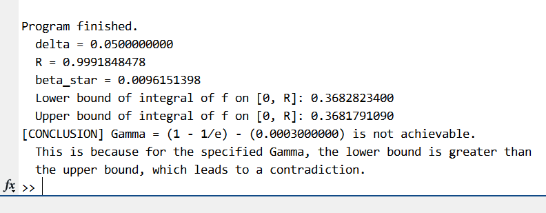

## Table of Contents

* [General Information](#general-information)
* [Technologies Used](#technologies-used)
* [Screenshots](#screenshots)
* [Usage](#usage)

## General Information
This project is the **verification program** for the paper _On the Perturbation Function of Ranking and Balance for Weighted Online Bipartite Matching_. It computes the numerical integral in Appendix B of the paper and tries to make the contradiction for given $\Gamma$.
## Technologies Used
* MATLAB R2022a.

## Screenshots

```

```

## Usage

- To verify the paper's result, simply run `Script`. See `Script.m` for details.
- Run `Main(gamma, delta)` to compute the numerical integrals as introduced in the paper. `gamma` is the value of $(1 - 1/e - \Gamma)$ which should satisfy $0 \le \texttt{gamma} < (1/2-1/e)$. `delta` is the value of $\delta$ in the paper.
- Run `Opt(gamma)` to use Bayesian optimization library in MATLAB and tries to find a best `delta` for our purpose. Can be used to obtain a slightly larger gap than $3\times 10^{-4}$.

